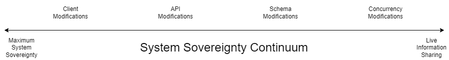
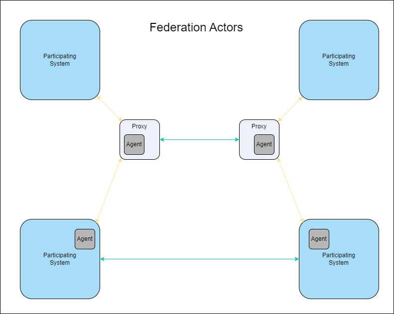

# Draft Federation Protocol Specification

## Introduction
The intention of data federation is to free up information from the silos of proprietary software.  There are several promising initiatives in this sphere, among which [ForgeFed](https://forgefed.org/spec/) is a project of particular note, and to a lesser extent the [Data Transfer Initiative](https://dtinit.org/) (DTI).  Those each focus on a specific information subdomain - source code forges and social media respectively.  The Federated Task-Tracking project takes a somewhat different approach - whilst it also addresses some of the same concerns as ForgeFed (namely issue-tracking), it also considers the general case of data federation, and live information sharing.

This project has built on the foundations laid in its predecessor [Federated Timesheets](https://github.com/federatedbookkeeping/timesheets).  That did not attempt to define any kind of protocol around federation, but rather to demonstrate the concept for a very specific subdomain.

A full-blown formal protocol specification is also beyond the scope of this project, in that it forms a relatively small part of that scope, so the content of this specification is high-level and conceptual.  A future project may expand upon this, taking into account complementary efforts in related projects.

## Goals
These may be summed up in the pithy phrase 'Connected, but sovereign', referring to applications participating in a data-sharing federation.
### Data Sovereignty
In an increasingly SaaS-orientated age, in which applications provided as an internet service store and manage the information they bring in and generate on their users' behalf, the ability to share that information with others is constrained by the reluctance of those providers to facilitate that sharing.  This is because they regard it as a commercial risk of customer churn, which they need to minimise so they can continue to grow their revenues in line with shareholder requirements.  The question of data ownership is complex, and outside this specification's scope, but customers of SaaS providers nevertheless desire to be able to use their data in the way they see fit, in software tools of their choosing, and this means being able to move their data between systems.  Historically, this was primarily through export as a one-way migration, but expectations have latterly grown to being able to do so more interactively, maintaining the same data in different systems for various purposes.

### Enable More Seamless Information Sharing
One of those purposes is to be able to share information of common interest between different people using software tools of their choice, either within the same organisation, or across multiple organisations.  Federation needs to enable that.

### Enable More Effective Collaboration
Whilst the majority of use cases pertaining to information sharing are asynchronous in nature, a subset benefit from real-time sharing.  These fall into the category of collaborative editing, where information needs to be shared real-time.  This has also been considered within this specification.

## Trade-offs
The second and third goals above are in tension, and give rise to certain trade-offs being necessary in the protocol design.
### Data Sovereignty vs. Real-Time Sharing
One implication of _system_ sovereignty (by contrast with data sovereignty) is that any demands upon it for change in order to interact with other systems should be minimised.  Live information sharing, however, requires much closer and deeper integration between participating applications, which requires substantive changes to each to enable.  This applies not only technically (where modifications are needed to support real-time data exchange) but also philosophically, in that those applications need to cede control of the metadata describing the data they wish to share to an agreed common structure.  See the m-ld article [Sustaining Truth across Integrated Applications - converge physical sources into one logical source](https://m-ld.org/news/) for a more in-depth treatment of this topic.

There is hence a continuum between maximum system sovereignty on one hand, and full real-time data sharing at the other.

The impact of this trade-off is that multiple flavours of the protocol therefore arise, depending on where on that continuum the participating systems sit.

## Core Protocol Logic
### Actors
#### Participating Systems
These are the applications actually participating in the federation, in whatever capacity.

#### Proxies
For Participating Systems on the extreme left-hand of the System Sovereignty Continuum, with stringent sovereignty requirements meaning they cannot be modified, proxies interact with them to read and write data on their behalf from and to other systems.
#### Agents
These are the software components in the Participating Systems or Proxies that detect data changes from elsewhere, evaluate them for whether they need to be passed on to other systems in the federation, and initiate that task.
### High-Level Logical Operations
#### Read
Almost self-expanatory in nature, this requests data from another system in a federation - either directly or via a proxy.
#### Write
Similarly, this writes data to another participating system, either directly or via a proxy.
#### Trigger
Akin to an event in a Pub-Sub architecture, a Trigger detects a change to data relevant to the federation, prompting a particular Agent to carry out an Operation.
#### Propagation Check
Specific to federation, this Operation occurs immediately in response to a Trigger, and determines whether the change detected needs to be propagated to other Pariticpating Systems.
## Security
### Authentication and Authorization
Participating Systems or their Proxies use and cache the credentials required to access other Participating Systems.  These can take the form of username and password (with corresponding permissions set in the target system), JSON Web Tokens (with authorization scopes set in the JWT), or X.509 client certificates, depending on what those systems require.
### Encryption
#### Data at Rest
This is beyond this specification's scope.
#### Data in Flight
To ensure the confidentiality (and hence privacy) of the information exchanged, this specification strongly recommends that network traffic be encrypted using X.509 server certificates.