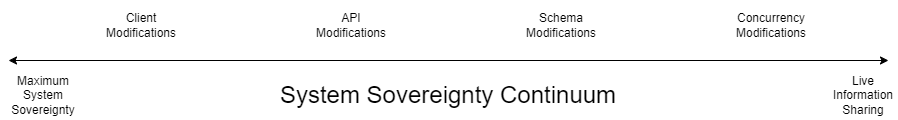
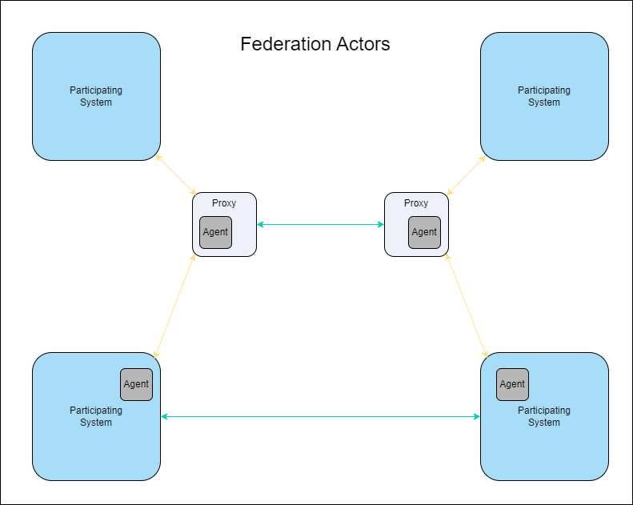

# Guide to System and Data Federation

## Goals
How you go about federating different applications in practice depends on what you actually want to achieve by doing so.  

These are summed up in the pithy phrase 'Connected, but sovereign', referring to applications participating in a data-sharing federation.

### Data Sovereignty
This refers to an individual or organisation's freedom to use data in a system of their choosing, rather than solely in the one(s) where they were created.  Historically, this was primarily through export as a one-way migration, but expectations have more recently grown to being able to do so more interactively, maintaining the same data in different systems for various purposes.

### Enable More Seamless Information Sharing
One of those purposes is to be able to share information of common interest between different people using software tools of their choice, either within the same organisation, or across multiple organisations.  Federation needs to enable that.

### Enable More Effective Collaboration
While most use cases information sharing use cases are asynchronous in nature, some of them benefit from real-time sharing.  These fall into the category of collaborative editing, where information needs to be shared as it changes.  This guide also considers this.

## Trade-offs and Constraints
When deciding on the best approach to federating applications, there are certain trade-offs and constraints you need to consider.  The first and third goals above are in tension, and the design of any federation including both of those needs to take that into account.
### System Sovereignty vs. Real-Time Sharing
One implication of _system_ sovereignty (by contrast with data sovereignty) is that any demands upon it for change in order to interact with other systems should be minimised - or even zero.  Live information sharing, however, requires much closer and deeper integration between participating applications, which requires substantive changes to each to enable.  This applies not only technically (where modifications are needed to support real-time data exchange) but also philosophically, in that those applications need to cede control of the metadata describing the data they wish to share to an agreed common structure.  See the m-ld article [Sustaining Truth across Integrated Applications - converge physical sources into one logical source](https://m-ld.org/news/) for a more in-depth treatment of this topic.

There is hence a continuum between maximal system sovereignty on one hand (i.e. where they admit of no change to accommodate other federation members' needs), and full real-time data sharing at the other, with degrees of flexibility inbetween.

The impact of this trade-off is that multiple variants of the protocol therefore apply, depending on the goals of the federation, and where on that continuum the participating systems sit.

### Non-duplication of Data
The propagation of data between Participating Systems must not result in the same data being stored by any one of them; each system (or Proxy) receiving data from another must verify that the data in question have not previousy been received.

## Core Logic
This gives an overview of the different elements of a federation, which will help you design the right approach.

### Actors
The diagram below depicts the main Actors comprising a federation.

#### Participating Systems
These are the applications actually participating in the federation, in whatever capacity.  These may be maximally sovereign, or more flexible, catering for different schemata in other systems.
#### Proxies
For maximally sovereign Participating Systems, proxies read and write data on their behalf from and to other systems.  In this project, [BridgeBot](https://github.com/federatedbookkeeping/bridgeBot) is one example of a federation proxy.
#### Agents
These software components in flexible Participating Systems or Proxies have the following responsibilities:
 - Detect data changes from elsewhere;
 - Determine whether they need to be passed on to other systems in the federation; and if so
 - Initiate that task.
### High-Level Logical Operations
#### Read
Almost self-expanatory in nature, this requests data from another system in a federation - either directly or via a proxy.
#### Write
Similarly, this writes data to another participating system, either directly or via a proxy.
#### Trigger
Akin to an event in a Pub-Sub architecture, a Trigger detects a change to data relevant to the federation, prompting a particular Agent to carry out an Operation.
#### Propagation Check
Specific to federation, this Operation occurs in an Agent immediately in response to a Trigger, and determines whether the change detected is new, or has been received previously from another Particpating System.
### Propagation Mechanisms
#### Polling
Participating Systems (or their Proxies) may poll others for changes in data.
#### Publish-Subscribe
Participating Systems (or their Proxies) may publish changes to data on a message queue for others subscribing to that queue to collect.
#### Webhooks
The federation connectivity between Participating Systems may permit the configuration of WebHooks - essentially callback URLs - for other systems to use to retrieve changed data upon being notified of their existence (via a notification-only variant of the above Publish-Subscribe mechanism).

## Schemata, Semantics, Formats, and Identifiers
Federated applications will likely have different schemata expressing their data structure, and different ways of defining the identifiers of individual data entities.

### Schema Agreement
Participating Systems (or their Proxies) need to be able to agree on the schema used for the relevant domain of shared information.  This may be accomplished in one of the two following ways, depending on where they sit on the System Sovereignty Continuum:
 - Metadata mapping; or
 - Shared schema in a CRDT domain representing common metadata
### Semantics
Often overlooked when performing schema mapping between different systems is the scope of meaning of each individual field.  For example, the word "Task" may refer to one specific detailed activity in one application, and the overarching container for multiple activities in another.  It is very important to ensure that it is _concepts_ that are mapped, rather than just metadata fields.
### Data Formats
Different applications frequently take divergent approaches to formatting data.  This might be in relatively tractable ways, such as different date formats, or more challenging alternatives, like JSON-structured vs. XML-formatted or scalar data.
### Entity Identifiers
Each entity requires an LRI (Local Resource Identifier) which is mapped to its ORI (Original Resource Identifier), the identifier assigned to the entity in its Home System.

This may be accomplished in one of the two following ways, depending on the Systems' position on the Sovereignty Continuum:
- Add metadata to suitable fields in each Participating System, showing equivalent records in other systems; or
- Uniquely identify entities with URIs in the m-ld domain used for live data sharing.

## Security

### Authentication and Authorization
Participating Systems or their Proxies use and cache the credentials required to access other Participating Systems.  These can take any of the follosing forms, depending on what those systems require:
- Username and password (with corresponding permissions set in the target system);
- JSON Web Tokens (with authorization scopes set in the JWT);
- X.509 client certificates;
- Federated identities, if these are common to more than one of the Participating Systems.
### Encryption
#### Data at Rest
To ensure confidentiality (and hence privacy), data should be encrypted when stored.
#### Data in Flight
The same applies when information is exchanged, network traffic should be encrypted using X.509 server certificates.

## Decision Tree
The decision tree below will help guide you through the optimum approach to federating applications.

NB: This is currently under development, and will be added as soon as it is ready.